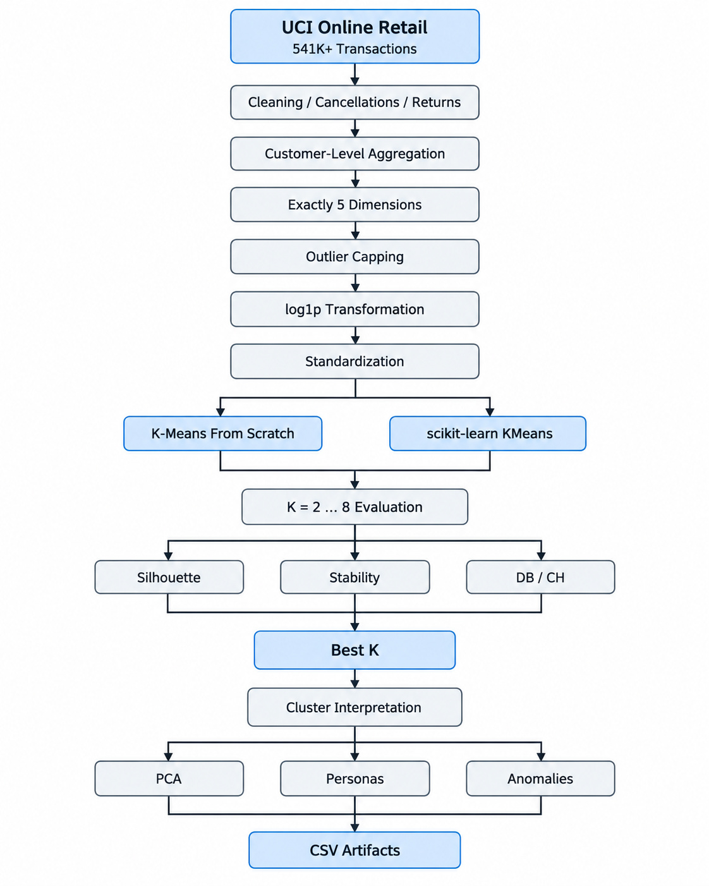
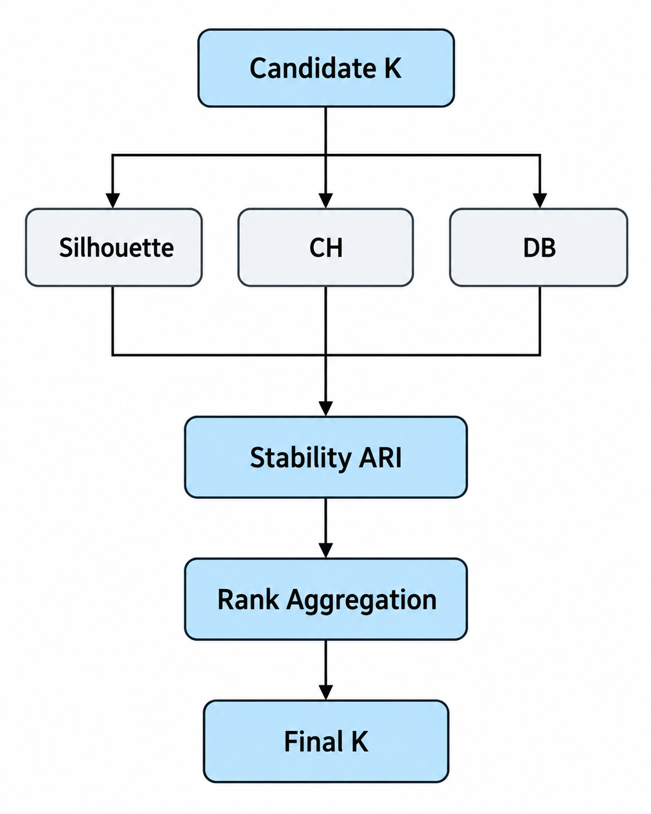
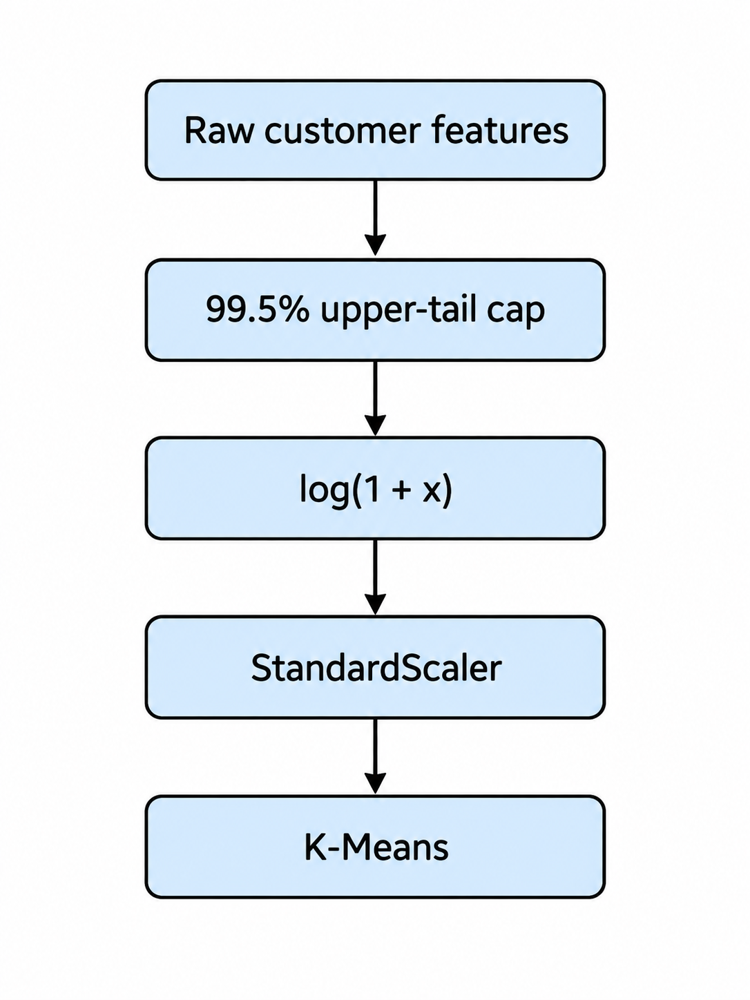

# CustomerAtlas-5D

<p align="center">
  <b>K-Means from Scratch on 541K+ Real Retail Transactions</b>
</p>

<p align="center">
  5D Feature Engineering · K-Means++ · Model Selection · Stability Analysis · PCA · Customer Personas
</p>

---

## Overview

**CustomerAtlas-5D** is a complete unsupervised-learning project built around the
UCI **Online Retail** dataset.

Rather than running K-Means on a toy blob dataset, the project begins with more
than **541,000 real transactions**, cleans the transaction stream, and creates a
five-dimensional behavioral representation for every customer.

The final clustering space is:

```text
Customer
   |
   +-- RecencyDays
   +-- Frequency
   +-- Monetary
   +-- AvgOrderValue
   +-- ProductDiversity
```

Then the repository implements K-Means twice:

1. **from scratch in NumPy**
2. **scikit-learn KMeans** as an independent baseline

---

## Why this project is interesting

A simple clustering demo looks like:

```text
clean matrix
    |
 KMeans.fit()
    |
 clusters
```

CustomerAtlas performs the full pipeline:

<p align="center">
  
</p>

---

## The Five Dimensions

| Feature | Definition |
|---|---|
| `RecencyDays` | Days since the customer's most recent purchase |
| `Frequency` | Number of unique positive orders |
| `Monetary` | Total positive revenue |
| `AvgOrderValue` | Revenue divided by number of orders |
| `ProductDiversity` | Number of unique products purchased |

These dimensions are engineered from the raw transactional data.

---

## K-Means From Scratch

The custom implementation in `src/kmeans5d.py` includes:

- K-Means++ initialization
- fully vectorized squared-distance computation
- Lloyd iterations
- multiple random restarts
- convergence tolerance
- empty-cluster recovery
- inertia tracking
- `fit`, `predict`, `fit_predict`, and `transform`

Core loop:

```python
distance = ||x - centroid||^2
labels   = argmin(distance)
centroid = mean(points in cluster)
```

but implemented efficiently for an arbitrary `N x 5` matrix.

---

## Model Selection

The notebook does **not** pick K using only the elbow method.

For every candidate `K = 2 ... 8`, it evaluates:

- inertia
- silhouette score
- Calinski-Harabasz score
- Davies-Bouldin score
- repeated-seed clustering stability

A rank-aggregation step combines the non-monotonic validation criteria.

<p align="center">
  
</p>

---

## Cluster Validation

The repository compares the from-scratch implementation with scikit-learn using
**Adjusted Rand Index**.

ARI is useful here because cluster IDs may be permuted:

```text
Scratch labels:  0 0 1 1 2 2
sklearn labels:  2 2 0 0 1 1
```

These partitions are equivalent even though the numeric labels differ.

---

## Creative Analysis

The notebook includes:

- raw-distribution diagnostics
- K-Means convergence curve
- elbow analysis
- silhouette analysis
- Davies-Bouldin analysis
- repeated-seed stability
- 2D PCA customer map
- 3D PCA "customer constellation"
- cluster-DNA centroid heatmap
- feature separation analysis
- cluster personas
- rare-customer / anomaly lens
- country-based post-cluster validation
- CSV/JSON export

---

## Repository Structure

```text
CustomerAtlas-5D-KMeans/
│
├── notebooks/
│   └── CustomerAtlas_5D_KMeans.ipynb
│
├── src/
│   ├── __init__.py
│   ├── kmeans5d.py
│   ├── data_pipeline.py
│   └── evaluation.py
│
├── scripts/
│   ├── fetch_data.py
│   └── run_analysis.py
│
├── tests/
│   ├── test_kmeans.py
│   └── test_pipeline.py
│
├── data/
│   └── README.md
│
├── outputs/
│   └── README.md
│
├── .github/
│   └── workflows/
│       └── ci.yml
│
├── DATASET.md
├── requirements.txt
├── Makefile
├── LICENSE
├── .gitignore
└── README.md
```

---

## Dataset

The project automatically downloads:

**UCI Online Retail**

- 541,909 transaction records
- UK-based non-store retailer
- Dec 2010 — Dec 2011
- UCI dataset ID: `352`
- DOI: `10.24432/C5BW33`
- License: **CC BY 4.0**

The original source file is intentionally not committed into Git.

Download/cache it with:

```bash
python scripts/fetch_data.py
```

See [`DATASET.md`](DATASET.md) for attribution details.

---

## Quick Start

```bash
git clone https://github.com/YOUR_USERNAME/CustomerAtlas-5D-KMeans.git
cd CustomerAtlas-5D-KMeans

python -m venv .venv
source .venv/bin/activate

pip install -r requirements.txt
```

Download the dataset:

```bash
python scripts/fetch_data.py
```

Run the notebook:

```bash
jupyter notebook notebooks/CustomerAtlas_5D_KMeans.ipynb
```

Or run the non-interactive pipeline:

```bash
python scripts/run_analysis.py
```

---

## Run Tests

```bash
pytest -q
```

The test suite checks:

- custom K-Means on separated 5D clusters
- prediction output shape
- customer feature engineering
- exact five-dimensional output contract

---

## Generated Artifacts

After running the project:

```text
outputs/
├── customer_clusters.csv
├── cluster_personas.csv
├── k_selection_metrics.csv
├── k_selection_ranked.csv
├── standardized_centroids.csv
├── feature_importance.csv
└── summary.json
```

---

## Why preprocessing is important

K-Means uses Euclidean distance.

Retail variables such as Monetary and Frequency are extremely right-skewed.
Without preprocessing, a few high-volume customers can dominate the geometry.

The project therefore uses:

<p align="center">
  
</p>


---

## Research Extensions

Interesting extensions include:

- MiniBatch K-Means
- RAPIDS cuML GPU K-Means
- FAISS K-Means
- Gaussian Mixture Models
- DBSCAN / HDBSCAN
- cluster migration over time
- customer lifetime value
- autoencoder embeddings
- spherical K-Means
- streaming clustering
- cluster-aware recommendation systems

---

## Dataset Citation

> Chen, D. (2015). *Online Retail* [Dataset].  
> UCI Machine Learning Repository.  
> DOI: `10.24432/C5BW33`

Dataset license: **Creative Commons Attribution 4.0 International**.

---

## Author

### Matin Firoozbakht

<p align="center">
  <a href="https://github.com/matinfirooz">
    github.com/matinfirooz
  </a>
</p>

---

<p align="center">
  <b>CustomerAtlas-5D — Turn transactions into structure.</b>
</p>
